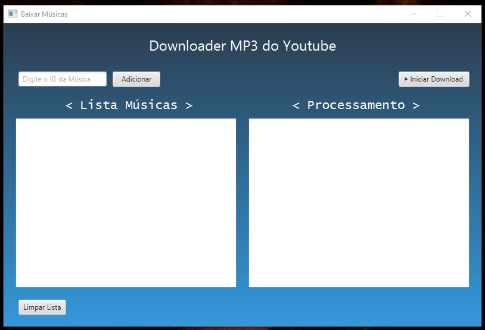

# YouTube Music Downloader

YouTube Music Downloader é uma aplicação desenvolvida em JavaFX que permite aos usuários criar uma lista de músicas do YouTube e baixá-las como arquivos de áudio. A interface é simples e intuitiva, oferecendo funcionalidade para adicionar IDs de músicas, visualizar uma lista de downloads e gerenciar o processo de download.

---

## Funcionalidades

- **Adicionar músicas à lista:** Insira o ID de uma música do YouTube e adicione-a à lista de downloads.
- **Gerenciar a lista:** Visualize as músicas que serão baixadas e limpe a lista, se necessário.
- **Baixar músicas:** Inicie o download de todas as músicas da lista com um único clique.
- **Processamento em tempo real:** Monitore o status do download diretamente na interface.

---

## Pré-requisitos

Certifique-se de que você possui os seguintes itens instalados no seu sistema:

- **Java JDK 11 ou superior**
- **Maven** (para gerenciamento de dependências)
- **JavaFX** (incluído no projeto ou configurado no ambiente)
- Conexão com a internet para baixar as músicas.

---

## Como usar

1. **Clone o repositório**
   ```bash
   git clone https://github.com/marcosjry/youtube-mp3-downloader.git
   cd youtube-music-downloader
   ```

2. **Instale as dependências**
   Compile o projeto com o Maven:
   ```bash
   mvn clean install
   ```

3. **Execute a aplicação**
   Inicie a aplicação:
   ```bash
   mvn javafx:run
   ```

4. **Use a interface**
    - Insira o ID de uma música do YouTube no campo de texto.
    - Clique no botão **Adicionar** para incluir a música na lista.
    - Quando estiver pronto, clique em **Iniciar Download** para baixar as músicas da lista.

---

## Estrutura da Interface

- **Campo de texto:** Insira o ID do vídeo do YouTube.
- **Botão "Adicionar":** Adiciona a música à lista de downloads.
- **"Lista Músicas":** Mostra os IDs ou títulos das músicas que serão baixadas.
- **Botão "Limpar Lista":** Remove todos os itens da lista.
- **Botão "Iniciar Download":** Inicia o download das músicas na lista.
- **"Processamento":** Exibe o status do download em tempo real.

---

## Dependências

A aplicação utiliza as seguintes bibliotecas e ferramentas:

- **JavaFX:** Framework para a interface gráfica.
- **java-youtube-downloader:** Biblioteca para download de vídeos e áudio do YouTube.

Adicione a dependência ao seu arquivo `pom.xml` caso necessário:
```xml
<dependency>
    <groupId>com.github.sealedtx</groupId>
    <artifactId>java-youtube-downloader</artifactId>
    <version>2.9.1</version>
</dependency>

<dependency>
   <groupId>org.openjfx</groupId>
   <artifactId>javafx-web</artifactId>
   <version>${javafx.version}</version>
</dependency>

<dependency>
   <groupId>org.openjfx</groupId>
   <artifactId>javafx-fxml</artifactId>
   <version>${javafx.version}</version>
</dependency>

<dependency>
   <groupId>org.openjfx</groupId>
   <artifactId>javafx-swing</artifactId>
   <version>${javafx.version}</version>
</dependency>
```


